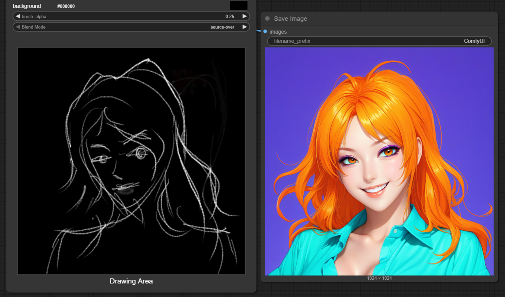
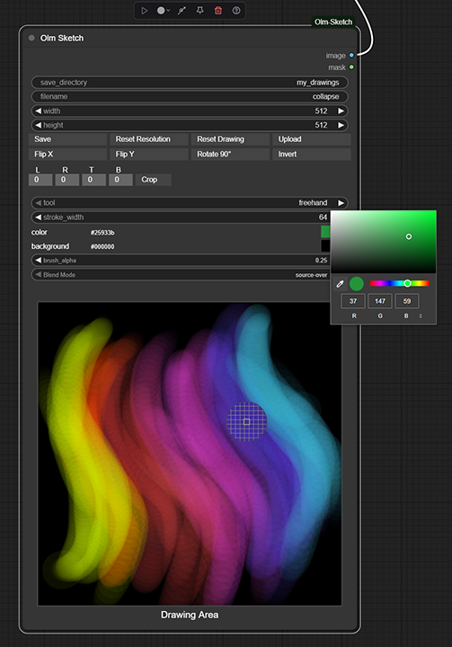
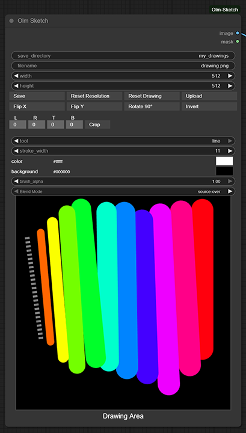
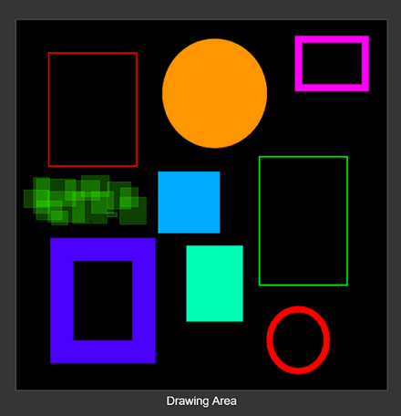
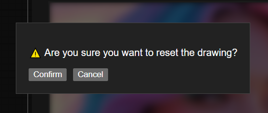

# Olm Sketch for ComfyUI

An interactive sketching and drawing node for ComfyUI with stylus/pen support – built for fast, intuitive scribbling directly inside your workflows, geared towards **ControlNet-style** workflows which utilize **scribbles and line art**.



- **Author:** Olli Sorjonen
- **GitHub:** [https://github.com/o-l-l-i](https://github.com/o-l-l-i)
- **X:** [https://x.com/Olmirad](https://x.com/Olmirad)
- **Version:** 1.0.1.1 (Chain original mouse event handlers to maintain subgraph header button functionality in ComfyUI frontend 1.24.4 and later.)

---

## ✨ What Is This?

**Olm Sketch** is a lightweight and responsive drawing node for [ComfyUI](https://github.com/comfyanonymous/ComfyUI). It lets you sketch or scribble directly inside the node graph - perfect for fast iterations, ControlNet workflows, or simple markups.

No need to jump to a painting app - you can draw, adjust, and export images without leaving ComfyUI or evaluating the graph.

Use it for:

- Quick sketching inside i2i workflows
- ControlNet scribble guides
- Painting base ideas without launching external tools
- Immediate visual feedback and iteration

---



## 🎨 Features

- ✍️ **Interactive Drawing UI**
  - Freehand and line tools
  - Line tool includes a dashed visual preview
  - Supports drawing rectangles and ellipses, with optional fill toggle

- 🧰 **Image Tools**
  - Flip X / Flip Y
  - Rotate 90°
  - Invert colors
  - Crop using numeric inputs (L, R, T, B)
  - Blur
  - Offset

- 🌈 **Flexible, Basic Brush System**
  - Stroke width: 1–1024 px
  - Alpha opacity for painterly blending
  - Blend modes: `source-over`, `multiply`, `screen`, `overlay`, `lighter`, `color-dodge`, `color-burn`, `xor`

- 🎨 **Color Picker**
  - RGB/HEX/HSV color input
  - Eyedropper, sample colors from canvas

- 🖼️ **Image Handling**
  - Upload existing image directly into node (no graph eval needed)
  - Save your sketch anytime to the ComfyUI output folder (`output/my_drawings` by default)

- 🧠 **Smart UX**
  - Realtime, responsive canvas
  - Node auto-resizes to match image
  - Supports up to 2048x2048px (4K+ in future updates)
  - Compact UI layout for a clean graph experience
  - Confirmations for potentially destructive operations

- 💡 **Persistence**
  - Images persist and can tolerate UI restart and backend restart
  - Permanently auto-saved images are stored to output/olm_sketch_cache
  - Temporary previous frames are saved to ComfyUI temp folder
    - Automatically culled during a session if you paint/sketch a lot (And ComfyUI restart flushes this dir)
---

## 📦 Installation

1. **Clone this repository into your `custom_nodes` folder.**

    ```bash
    git clone https://github.com/o-l-l-i/ComfyUI-Olm-Sketch.git
    ```

    Your folder should look like:

    ```
    ComfyUI/
    └── custom_nodes/
        └── ComfyUI-Olm-Sketch/
            ├── __init__.py
            ├── olm_sketch.py
            └── ...
    ```

2. **Restart ComfyUI** to load the new node.

There are no extra dependencies - it works out of the box.

---

## 🧪 Basic Usage

1. Add the **Olm Sketch** node from the node search menu.
2. Start drawing directly on the canvas in the node.
3. Use tool buttons and UI fields for crop, flip, rotate, etc.
4. To save your sketch, click the save button in the node.
    - Files are saved to `ComfyUI/output/my_drawings/` by default.
    - You can change the output subfolder and filename directly in the node UI.
    - Alternatively you can of course render it out and use Save Image node.
5. Automatic saving happens when saving scenes/graphs and files go to `ComfyUI/output/olm_sketch_cache/`.
6. Upload an image via the built-in UI to draw on an existing base.

---

## ⚠️ Known Limitations

- No built-in undo/redo support yet.
- 2048x2048 resolution limit (4K support planned.)
- No layer support - this is a lightweight sketch node, not a full painting suite.
- Very basic mask support - you can output an image as a mask (no overlay support or such yet.)
- Saved images are overwritten if using the same name (watch your filenames!)
- While I put effort to automatic save, do not trust it 100% yet.

---

## Pen support

- At least Wacom styluses seem to work; but very limited testing has been done so far.
- HTML color picker's eyedropper does not work at all with pen touch - map click (left) to a button to get around this issue.
- Pressure sensitivity did not function in browser (Chrome) when Windows Ink was disabled in Wacom settings.
- The pen controls sometimes start to fail and you can't adjust widgets.

---

## Updates 1.0.1

- Refactored to more modular code structure for new features (coming later) and maintainability
- Added new custom modular confirmation modals
- Added new custom modular input elements
- Added Canvas offset tool with wraparound
- Added simple radius based blur tool
- Improved mouse event handling
- Improved canvas interaction states
- Improved button UX (hover/click states)
- Improved input validation
- Improved widget size calculation (should reduce UI glitches)
- Improved dynamic node resize setup



---

## 💬 Notes

**This extension is experimental and under active development.**
Functionality, file formats, and behavior may change without notice, and compatibility with future updates is not guaranteed.
**Use at your own risk, especially in production workflows.**

Back up your projects frequently. Feedback, bug reports, and suggestions are always welcome - but expect breakage, quirks, and rough edges. This tool does what I need right now; future updates may be irregular depending on available time.

---

## Version History

- **1.0.1.1** Chain original mouse event handlers to maintain subgraph header button functionality in ComfyUI frontend 1.24.4 and later.
- **1.0.1** Restructuring code, new features.
- **1.0.0** Initial release.

---

## License & Usage Terms

Copyright (c) 2025 Olli Sorjonen

This project is source-available, but not open-source under a standard open-source license, and not freeware.

You may use and experiment with it freely, and any results you create with it are yours to use however you like.

However:

Redistribution, resale, rebranding, or claiming authorship of this code or extension is strictly prohibited without explicit written permission.

Use at your own risk. No warranties or guarantees are provided.

The only official repository for this project is:
👉 https://github.com/o-l-l-i/ComfyUI-Olm-Sketch

---

## Author

Created by [@o-l-l-i](https://github.com/o-l-l-i)
